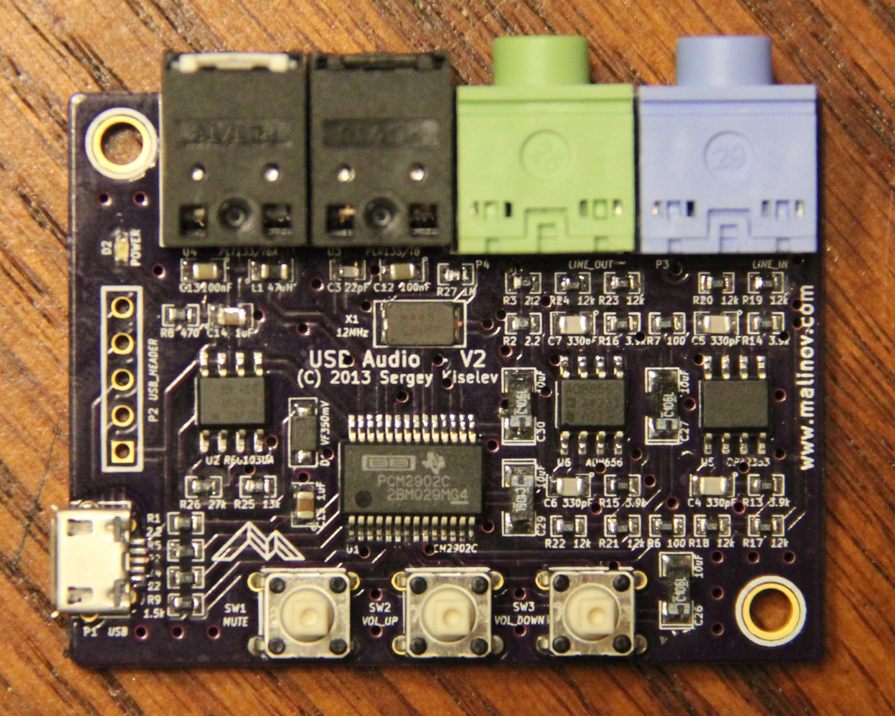
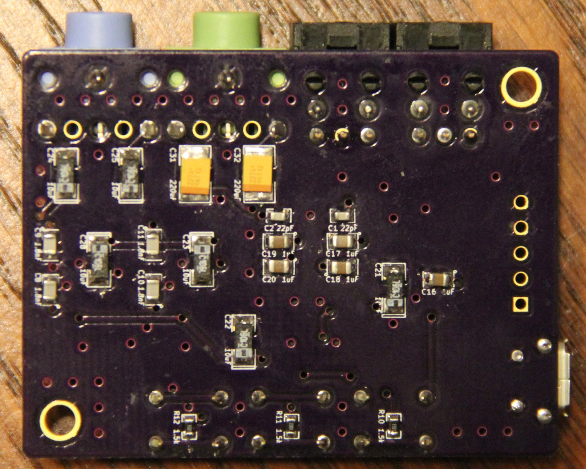

# Compact USB Audio Adapter

## Introduction
I was looking for a USB audio adapter for my Intel Galileo projects, and surprisingly I was not able to find a compact USB audio adapter which will offer line input or digital (optical) input and output. Most USB audio dongles available on the market are intended to be used with a headset and only offer monophonic microphone input. One exception was Behringer UCA202 which is bulky for my projects. And so I've designed this adapter.

## Overview
This USB Audio adapter can be used with small SBCs like Intel Galileo, Raspberry Pi, or BeagleBone Black to provide high quality audio input and output. Its size is only 2.1 x 1.6 inches (53.44 x 40.74 mm). This USB Audio adapter will also work with regular PCs, Android based smartphones and tablets, or almost everything else that supports USB audio. It is based on popular Texas Instruments (was Burr Brown) PCM2902C, and schematic mostly follows Texas Instrument's reference design.

### Photos
#### Top side

#### Bottom side

## Design
As mentioned above the main component is Texas Instruments PCM2902 USB audio codec IC (U1). Additionally the circuit uses Texas Instruments REG103UA LDO IC for conditioning power for the analog circuitry (U2) and a pair of dual channel operational amplifier ICs that work as low pass filters for input and output (U5 and U6).

### Schematic and PCB Layout

[Schematic - Version 2.0](KiCad/USB_Audio-Schematic-2.0.pdf)

[PCB Layout - Version 2.0](KiCad/USB_Audio-Board-2.0.pdf)

### Design Modifications and Components' Substitution
There is a lot of flexibility in the design:
* The USB audio codec IC (U1) can be PCM2902, PCM2906, PCM2900, and PCM2904.
  * PCM2902 and PCM2906 provide S/PDIF digital interface. PCM2900 and PCM2904 do not provide it.
  * The difference between PCM2902 and PCM2906 or between PCM2900 and PCM2904 is very subtle: PCM2900 and PCM2902 specify 100mA as Maxpower value in USB descriptor, while PCM2904 and PCM2906 specify 500mA. Operating systems should be using Maxpower values to estimate power consumption by the attached USB devices and disconnect USB devices if host is unable to supply enough power.
  * If using codec without S/PDIF support the components related to optical input and output should not be mounted.
  * I used the latest PCM290xC revision. Other, older revisions don't differ significantly and can be used as well.
* The REG103 LDO (U2) is optional and can be removed to lower the cost at some audio quality degradation. It is also possible to replace it with cheaper LDO with minor schematic and PCB modifications.
* The design uses high-speed operational amplifiers. Either one of these op amps or both can be bypassed, leaving just 100 ohm / 10 uF capacitors for audio coupling. It is also possible to use other compatible operational amplifiers (important characteristics: single power supply 3.3V, rail-to-rail)
* Both input and output parts are optional. For example if only ADC part is needed, no need to assemble components related to audio output. Same applies for DAC only (audio output only) use. In this case I suggest grounding audio inputs of PCM2902 to avoid noise.
* The PCB supports two options for connecting to USB:
  * Using Micro USB connector
  * Using 5-pin header (it is also possible to solder a USB cable directly to the board instead of this header).
* Volume control buttons are optional

### Assembly Notes
Due to project's size and component availability the project mostly uses SMT components. I used through hole components for components that are subject to physical stress (connectors and buttons). It it is not too difficult to solder SMT components it with some practice. Here are some tips:

* Have a well lighten workspace.
* Use a low power (25W or so) soldering iron with thin tip, better yet a temperature controlled soldering station. Keep the tip of soldering iron clean.
* Use thin solder with flux. Have some desoldering braid to remove accidental solder bridges or excess solder.
* I found it convenient first to put some solder on a first pad of a component (or on two opposite pads in case of an IC. When put the component using tweezers and heat the pad at the same time. Next double check component orientation and solder remaining pads. Note that diodes and tantalum capacitors are polarized, so the orientation is important.
* Solder ICs first, next solder micro USB connector.
* After that solder all the resistors, inductor, and smaller (0603 and 0805) capacitors on the top side, going from ICs to sides of the board.
* Solder Schottky diode, LED, crystal resonator, and tantalum capacitors. Make sure to check that they are oriented properly.
* Turn the board up side down, and solder resistors and the capacitors on the bottom side.
* Finally solder through hole components: connectors, optical modules, buttons.
* Clean the flux remains with some alcohol. (Be careful not to get alcohol/flux inside optical modules, or maybe solder them after cleaning the board).
* Search the Internet for SMT soldering tutorials.

### Bill of Materials
[USB Audio project on Mouser.com](http://www.mouser.com/ProjectManager/ProjectDetail.aspx?AccessID=4c01b1b0e1) - View and order all components except of the PCB, screws and nuts.

[USB Audio project on OSH Park](http://oshpark.com/shared_projects/Dffqy1VF) - View and order PCB.

Component type     | Reference | Description                                 | Quantity | Possible sources and notes
------------------ | --------- | ------------------------------------------- | -------- | --------------------------
PCB                |           | USB Audio PCB - V2                          | 1        | Order at [OSH Park](http://oshpark.com/shared_projects/Dffqy1VF) or from any other PCB manufacturer using Gerber files from [gerber](gerber) folder.
Capacitor          | C1 - C3   | 22pF C0G SMT 0603 capacitor                 | 3        | Mouser [77-VJ0603A220JXACBC](https://www.mouser.com/ProductDetail/77-VJ0603A220JXACBC). Note: C3 is not needed if not implementing optical S/PDIF input.
Capacitor          | C4 - C7   | 330pF C0G SMT 0805 capacitor                | 4        | Mouser [77-VJ0805A331KXACBC](https://www.mouser.com/ProductDetail/77-VJ0805A331KXACBC)
Capacitor          | C8 - C11  | 1.8nF C0G SMT 0805 capacitor                | 4        | Mouser [81-GRM215C1H182JA01D](https://www.mouser.com/ProductDetail/81-GRM215C1H182JA01D)
Capacitor          | C12, C13  | 100nF X7R SMT 0805 capacitor                | 2        | Mouser [80-C0805C104K3R7210](https://www.mouser.com/ProductDetail/80-C0805C104K3R7210]. Note: These capacitor are not needed if not implementing optical S/PDIF input and output.
Capacitor          | C14 - C20 | 1uF X7R SMT 0805 capacitor                  | 7        | Mouser [80-C0805C105K4R](https://www.mouser.com/ProductDetail/80-C0805C105K4R]
Capacitor          | C21 - C30 | 10uF tantalum SMT capacitor                 | 10       | Mouser [74-593D106X9016A2TE3](https://www.mouser.com/ProductDetail/74-593D106X9016A2TE3)
Capacitor          | C31, C32  | 220uF tantalum SMT capacitor                | 2        | Mouser [581-TLNT227M010R1300](https://www.mouser.com/ProductDetail/581-TLNT227M010R1300). Note: Use the recommended value if driving low impedance loads (for example headphones). For high impedance loads (e.g. line output connected to an amplifier) cheaper 10uF capacitors can be used. See previous line for part number.
Schottky Diode     | D1        | Schottky diode with low voltage drop (350mV) | 1       | Mouser [771-PMEG2010ER115](https://www.mouser.com/ProductDetail/771-PMEG2010ER115)
LED                | D2        | 0603 LED                                    | 1        | Mouser [78-VLMTG1300-GS08](https://www.mouser.com/ProductDetail/78-VLMTG1300-GS08). Any color can be used :-) The suggested part is "pure" green. It is too bright to my taste, so if using it consider increasing value of R8. Or use "conventional" green and save a few cents.
Inductor           | L1        | 47uH SMT 0805 inductor                      | 1        | Mouser [963-LBR2012T470K](https://www.mouser.com/ProductDetail/963-LBR2012T470K). Note: This inductor is not needed if not implementing optical S/PDIF input.
Connector          | P1        | Micro USB receptacle with through hole pegs | 1        | Mouser [649-10118194-0001LF](https://www.mouser.com/ProductDetail/649-10118194-0001LF). Note: Use either P1 or P2
Connector          | P2        | Pin Header 5x1, 2.54 mm lead spacing        | 1        | Mouser [649-68000-105HLF](https://www.mouser.com/ProductDetail/649-68000-105HLF). Note: Use either P1 or P2
Connector          | P3        | 3.5 mm stereo audio jack, blue              | 1        | Mouser [806-STX-31203B284C](https://www.mouser.com/ProductDetail/806-STX-31203B284C)
Connector          | P4        | 3.5 mm stereo audio jack, green             | 1        | Mouser [806-STX-31203B577C](https://www.mouser.com/ProductDetail/806-STX-31203B577C)
Resistor           | R1 - R3   | 2.2 ohm 1% SMT 0603 resistor                | 3        | Mouser [71-CRCW0603-2.2-E3](https://www.mouser.com/ProductDetail/71-CRCW0603-2.2-E3). Note: For R2 and R3 use the recommended value if driving low impedance loads. For high impedance load resistance can be increased to 100 ohm. See R6, R7 line for part number.
Resistor           | R4, R5    | 22 ohm 1% SMT 0603 resistor                 | 2        | Mouser [71-CRCW0603-22-E3](https://www.mouser.com/ProductDetail/71-CRCW0603-22-E3)
Resistor           | R6, R7    | 100 ohm 1% SMT 0603 resistor                | 2        | Mouser [71-CRCW0603100RFKEB](https://www.mouser.com/ProductDetail/71-CRCW0603100RFKEB)
Resistor           | R8        | 470 ohm 1% SMT 0603 resistor                | 1        | Mouser [71-CRCW0603470RFKEB](https://www.mouser.com/ProductDetail/71-CRCW0603470RFKEB)
Resistor           | R9 - R12  | 1.5 Kohm 1% SMT 0603 resistor               | 4        | Mouser [71-CRCW0603-1.5K-E3](https://www.mouser.com/ProductDetail/71-CRCW0603-1.5K-E3)
Resistor           | R13 - R16 | 3.9 Kohm 1% SMT 0603 resistor               | 4        | Mouser [71-CRCW0603-3.9K-E3](https://www.mouser.com/ProductDetail/71-CRCW0603-3.9K-E3)
Resistor           | R17 - R24 | 12 Kohm 1% SMT 0603 resistor                | 8        | Mouser [71-CRCW0603-12K-E3](https://www.mouser.com/ProductDetail/71-CRCW0603-12K-E3)
Resistor           | R25       | 13 Kohm 1% SMT 0603 resistor                | 1        | Mouser [71-CRCW0603-13K-E3](https://www.mouser.com/ProductDetail/71-CRCW0603-13K-E3)
Resistor           | R26       | 27 Kohm 1% SMT 0603 resistor                | 1        | Mouser [71-CRCW0603-27K-E3](https://www.mouser.com/ProductDetail/71-CRCW0603-27K-E3)
Resistor           | R27       | 1 Mohm 1% SMT 0603 resistor                 | 1        | Mouser [71-CRCW06031M00FKEB](https://www.mouser.com/ProductDetail/71-CRCW06031M00FKEB)
Switch             | SW1 - SW3 | 6 mm x 6 mm tactile switch                  | 3        | Mouser [653-B3F-1050](https://www.mouser.com/ProductDetail/653-B3F-1050)
Switch Key Top     | SW1       | 4 mm x 6 mm tactile switch key top, red     | 1        | Mouser [653-B32-1080](https://www.mouser.com/ProductDetail/653-B32-1080)
Switch Key Top     | SW2       | 4 mm x 6 mm tactile switch key top, green   | 1        | Mouser [653-B32-1050](https://www.mouser.com/ProductDetail/653-B32-1050)
Switch Key Top     | SW3       | 4 mm x 6 mm tactile switch key top, blue    | 1        | Mouser [653-B32-1040](https://www.mouser.com/ProductDetail/653-B32-1040)
Integrated Circuit | U1        | Texas Instruments PCM2902C                  | 1        | Mouser [595-PCM2902CDB](https://www.mouser.com/ProductDetail/595-PCM2902CDB)
Integrated Circuit | U2        | Texas Instruments REG103UA-A                | 1        | Mouser [595-REG103UA-A](https://www.mouser.com/ProductDetail/595-REG103UA-A)
Optical Receiver Module |  U3  | Everlight PLR135/T8                         | 1        | Mouser [638-PLR135T8](https://www.mouser.com/ProductDetail/638-PLR135T8). Note: This module is not needed if not implementing optical S/PDIF input.
Optical Transmitter Module | U4 | Everlight PLT133/T8                        | 1        | Mouser [638-PLT133T8](https://www.mouser.com/ProductDetail/638-PLT133T8).  Note: This module is not needed if not implementing optical S/PDIF output.
Integrated Circuit | U5        | Texas Instruments OPA2353                   | 1        | Mouser [595-OPA2353UA](https://www.mouser.com/ProductDetail/595-OPA2353UA)
Integrated Circuit | U6        | Analog Devices AD8656                       | 1        | Mouser [584-AD8656ARZ](https://www.mouser.com/ProductDetail/584-AD8656ARZ)
Crystal Resonator  | X1        | 12 MHz                                      | 1        | Mouser [774-445C25D12M00000](https://www.mouser.com/ProductDetail/774-445C25D12M00000)

### 3D Printed Case Parts

Component type     | Description                                 | Quantity | Possible sources and notes
------------------ | ------------------------------------------- | -------- | --------------------------
3D Printed Part    | USB Audio Case Top                          | 1        | 3D Print [USB Audio Case Top](printed_parts/USB_Audio_Case_Top.stl)
3D Printed Part    | USB Audio Case Bottom                       | 1        | 3D Print [USB Audio Case Bottom](printed_parts/USB_Audio_Case_Bottom.stl)
Screw              | M3 x 10mm socket cap screw                  | 2        | Fastenal [MS2510010A20000](https://www.fastenal.com/products/details/MS2510010A20000)
Nut                | M3 square nut                               | 2        | Fastenal [0161907](https://www.fastenal.com/products/details/0161907)
